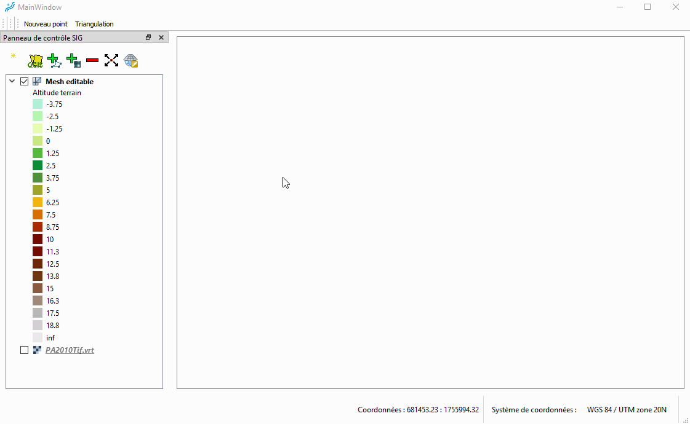
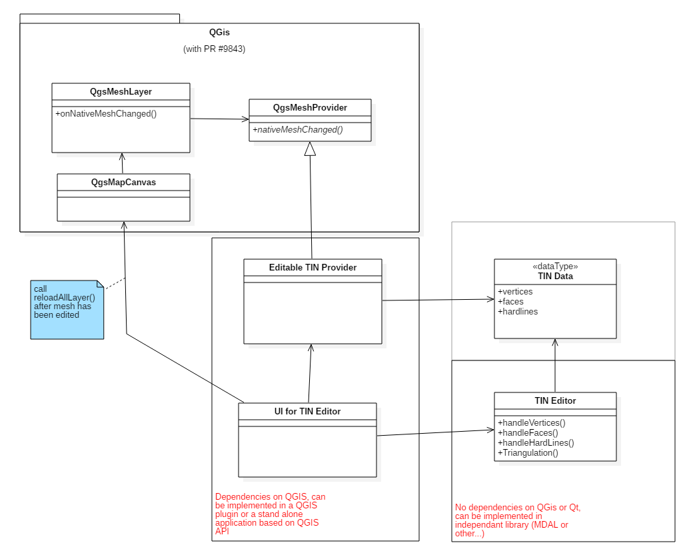

# Mesher
A mesher based on the QGis API

The aim of this project is to provide a Mesher in a GIS environment based on QGIS API.

This mesher will be able to generate TIN DEM and other unstructured grids for hydraulic models.

It will be a part of the Reos project, a free and open sources solution dedicated to hydrology and surface hydraulic (http://www.project.reos.site).

