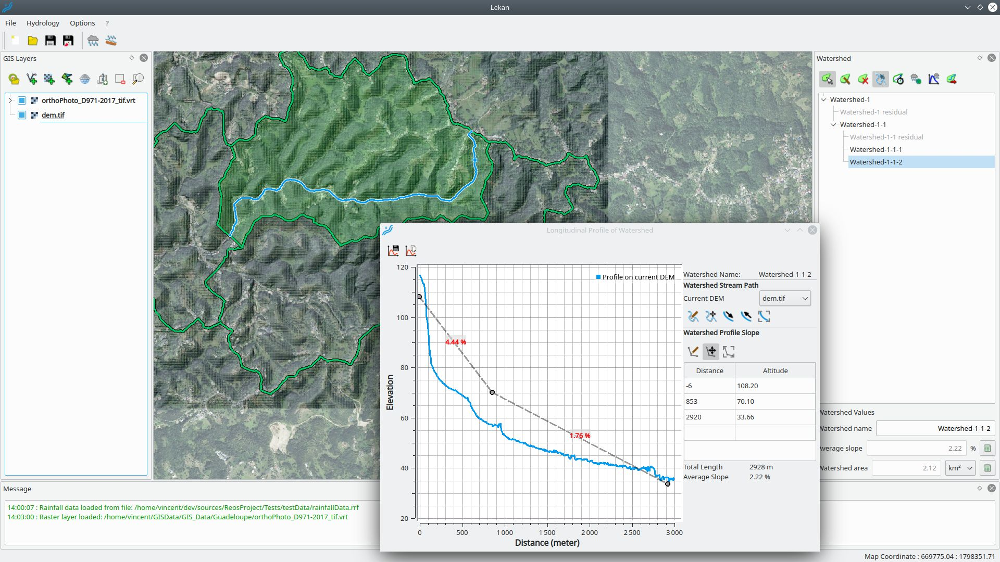
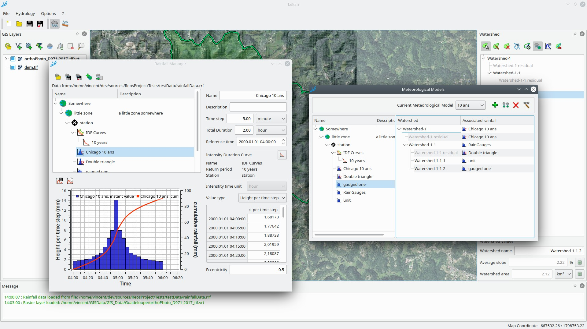
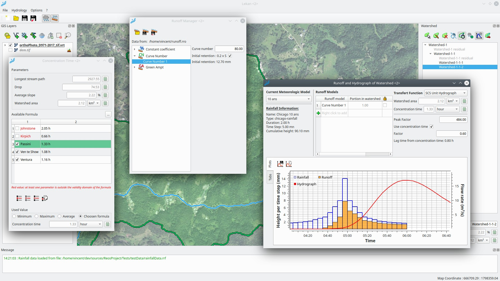
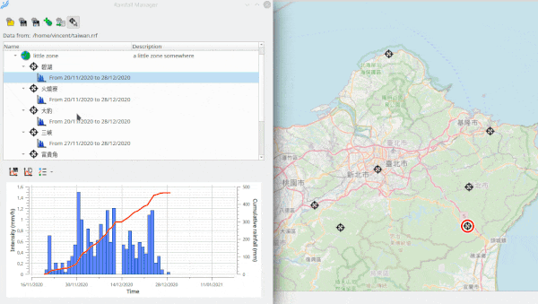
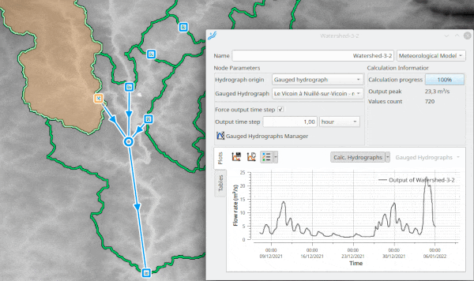

# Reos Project

The aim of this project is to provide free and open-source tools for hydrological and hydraulic analysis.

# Lekan

The aim of Lekan is to assist the user for hydrological or hydraulic studies.

The user works in a GIS environment based on QGIS engine.

Self installer of this tool can be downloaded [here](https://www.reos.site/en/reos-project/download/) (for Windows). For other platforms, building yourself the project could be possible.

Description and documentation about functionalities provided by the actual release is available in the wiki of this repo [here](https://github.com/vcloarec/ReosProject/wiki).

## Development

Lekan is in constant development, that is depending of available time or resources, new feature are regularly added. The only limit to provide new functionalities to help user in hydrological/hydraulic studies are imagination and ... time. Help is very welcome, to contribute, see [here](https://www.reos.site/en/how-to-support/) how to.

## Work in progress

Now, efforts of development are concentrated to allow the user to build 2D hydraulic models directly from Lekan:

- generate and edit mesh structure
- apply/edit topography on the mesh
- apply/edit roughness
- define boundary limit and link them to other part of the actual hydraulic network (watershed/hydrograph nodes, hydraulic routing link) 
- Launch external calculation engine from Lekan (existing modeling engine).
- Visualize and post-process result in Lekan.

