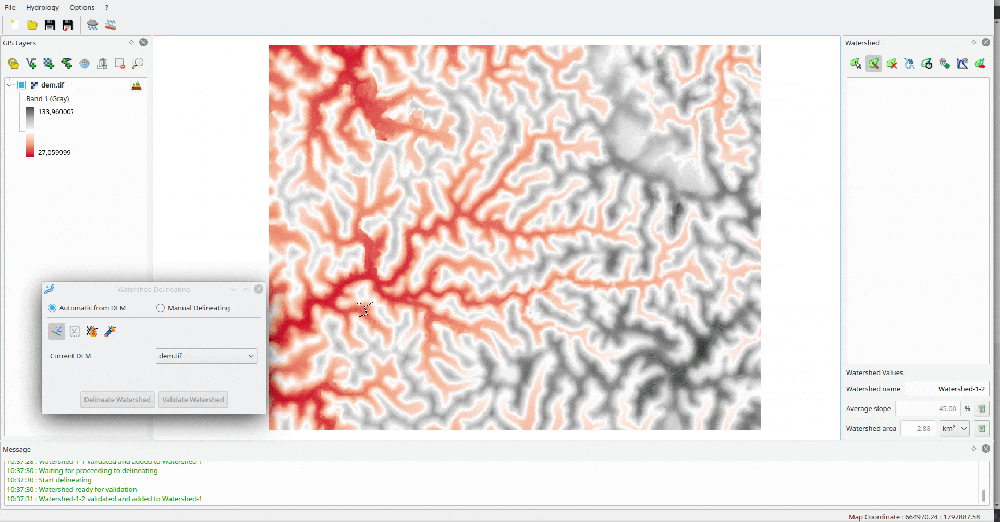

# Reos Project

The aim of this project is to provide free and open-source tools for hydrological and hydraulic analysis.

# Lekan

## Presentation

Self installer of this tool can be downloaded [here](https://www.reos.site/en/reos-project/download/) (for Windows).

The aim of Lekan is to assist the user for estimating runoff hydrographs.

The user is able to define watershed in the GIS environment (based on QGIS engine) and can evaluate the geometric characteristics from digital terrain models.

GIS environment allow to:
- load GIS data or open directly QGIS project for base map
- use raster DEM to automaticly delineate watershed and define longitudinale profile

The tool calculates concentration time with different formulas available and the user can apply runoff model to each watersheds.

With user defined rainfalls or designed rainfalls linked to watersheds following meteorological models, runoff hydrographs are calculated for each watersheds.

